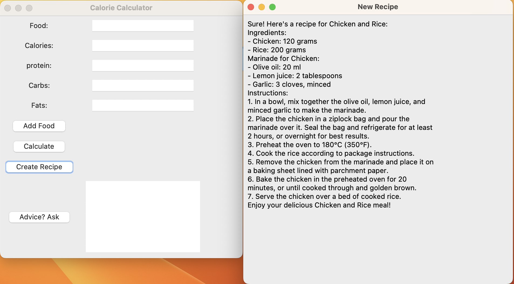
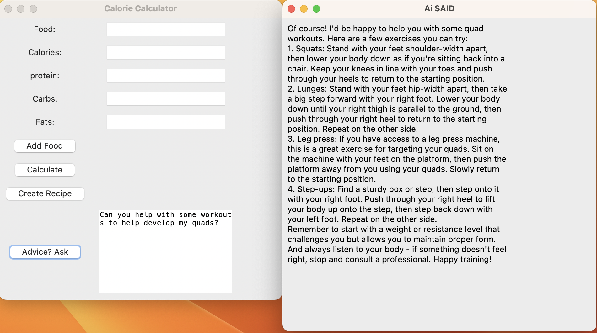

# MacroCalc
<!-- PROJECT LOGO -->
<br />
<p align="center">
  <a href="https://github.com/RamsesRomeroJr/MacroCalc">
    
  </a>

  <h3 align="center">Best-README-Template</h3>

  <p align="center">
    A Nutrition Calculator, Recipe Creator and AI Chat!
    <br />
    <br />
    ·
    <a href="https://github.com/RamsesRomeroJr/MacroCalc/issues">Report Bug</a>
    ·
    <a href="https://github.com/RamsesRomeroJr/MacroCalc/issues">Request Feature</a>
  </p>
</p>


<!-- TABLE OF CONTENTS -->
<details open="open">
  <summary>Table of Contents</summary>
  <ol>
    <li>
      <a href="#about-the-project">About The Project</a>
      <ul>
        <li><a href="#built-with">Built With</a></li>
      </ul>
    </li>
    <li>
      <a href="#getting-started">Getting Started</a>
      <ul>
        <li><a href="#prerequisites">Prerequisites</a></li>
        <li><a href="#installation">Installation</a></li>
      </ul>
    </li>
    <li><a href="#usage">Usage</a></li>
    <li><a href="#contact">Contact</a></li>
  </ol>
</details>


<!-- ABOUT THE PROJECT -->
## About The Project

A gym rats best friend! Wondering what the macros are looking like for you meal? Look no further as this calculator will let you know!
Need a recipe with foods you have? Need Advice from an AI? This is the Calculator for you

### Built With

* [Python](https://www.python.org/)
* [Tkinter](https://docs.python.org/3/library/tkinter.html)
* [Requests](https://pypi.org/project/requests/)
* [AI API](https://rapidapi.com/InfinitiSync/api/open-ai25)


<!-- GETTING STARTED -->
## Getting Started

how you can start setting up this project locally.
To get a local copy up and running follow these simple example steps.

### Prerequisites

* Python3
  - [Visit Here to see how to install on your local machine](https://www.python.org/downloads/)

### Installation

1. Get a free API Key at [Rapid API](https://rapidapi.com/InfinitiSync/api/open-ai25)
2. Clone the repo
   ```sh
   git clone https://github.com/RamsesRomeroJr/MacroCalc
   ```
3. Install Python requests
   ```sh
   Python3 -m pip install requests
   ```
4. Enter your API in `"X-RapidAPI-Key"`
   ```py
   headers = {
            "content-type": "application/json",
            "X-RapidAPI-Key": "<API HERE>",
            "X-RapidAPI-Host": "open-ai25.p.rapidapi.com"
        }
   ```


<!-- USAGE EXAMPLES -->
## Usage

### Some of the features that you can use

- Being able to input food and macros with "Add Food"


- Calculate inputed foods after entering them


- Create a recipe from inputed foods!


- Ask Ai A quick question! Maybe a workout?


<!-- CONTACT -->
## Contact

Ramses Romero Jr- [LinkedIn](https://www.linkedin.com/in/ramses-romero-jr/)
<br/>
Keshav Kalia- [LinkedIn](https://www.linkedin.com/in/keshavkalia4/)
<br/>
Martin Lam- [LinkedIn](https://www.linkedin.com/in/martin-lam-533190228/)
<br/>
Abhijit Yadav- [LinkedIn](https://www.linkedin.com/in/abhijit-yadav-783333260)

Project Link: [https://github.com/RamsesRomeroJr/MacroCalc](https://github.com/RamsesRomeroJr/MacroCalc)
